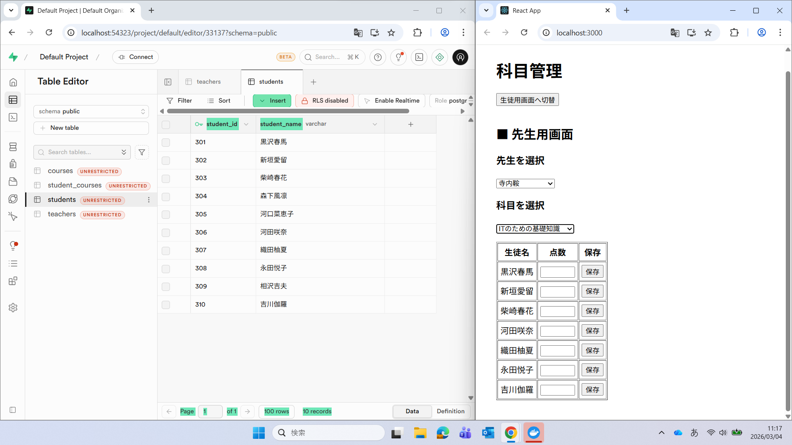

# DB Demo



-  
-  

- 

- 

本課題の目的は **データベース（DB）の操作に慣れること** です。

当社の業務ではデータベースを扱う機会が非常に多く、
日常的に SQL を用いたデータ取得・更新・分析を行っています。

---

## 🎯 この課題の目的

本課題では **DB操作に慣れること** を主な目的としています。

重点的に体験する内容：

- PostgreSQL（Supabase）を使ったDB操作
- SQLの実行
- フロントエンドとDBの接続確認

Dockerや環境構築はあくまで手段であり、
**最終的なゴールは「DBに触れることに慣れる」こと** です。

---

## 🧰 使用技術・ツール

### 🔹 データベース（主目的）
- PostgreSQL（Supabase）

### 🔹 フロントエンド（確認用）
- React
- HTML / CSS / JavaScript

### 🔹 開発環境
- Docker

### 🔹 任意ツール
- Git
- VS Code

---

# 🖥 事前準備

## ① Docker Desktop のインストール

https://docs.docker.com/desktop/setup/install/windows-install/

⚠ インストール後に **PCの再起動が必要です**

---

## ② Supabase CLI のインストール

### ダウンロード
https://github.com/supabase/cli/releases

V2.76.14で動作確認済み

### 配置例


C:\supabase


### 環境変数のPATH に追加


C:\supabase


動作確認：

```powershell
supabase --version
```
## ③ ソースコードの取得
### 方法1（初心者向け）

https://github.com/k-yamashita-sky/DB-demo/tree/main

「Code」→「Download ZIP」

### 方法2（上級者向け）
git clone https://github.com/k-yamashita-sky/DB-demo.git


# 🚀 アプリの起動方法

デスクトップに作業用フォルダがある想定です。

```
cd $HOME\Desktop
cd DB-demo-main
supabase start
docker compose up -d --build
```
## ✅ 起動確認
### 🌐 フロントエンド
http://localhost:3000
### 🗄 Supabase Studio
http://localhost:54323

## 🗄 サンプルデータベース作成

① SQLファイルを開く
supabase/sample_data.sql

② Supabase Studioへアクセス

http://localhost:54323

③ SQL Editor で実行

SQL Editor を開く

sample_data.sql の内容を貼り付け

Run CTRL を押す

## 📂 ディレクトリ構成
アプリの再起動など、環境構築マニュアルに書かれていないコマンドについてはコマンド集を参照してください。

```
📂 DB-demo-main
├── 📁 frontend
├── 📁 supabase
├── 📄 .gitignore
├── 📄 docker-compose.yml
├── 📄 README.md
├── 📄 supabaseのインストール場所.txt
├── 📄 コマンド集.txt
└── 📄 起動確認用のURL.txt
```

# 📚 参考資料

https://zenn.dev/it_pencil/articles/cfca8bc53b0267